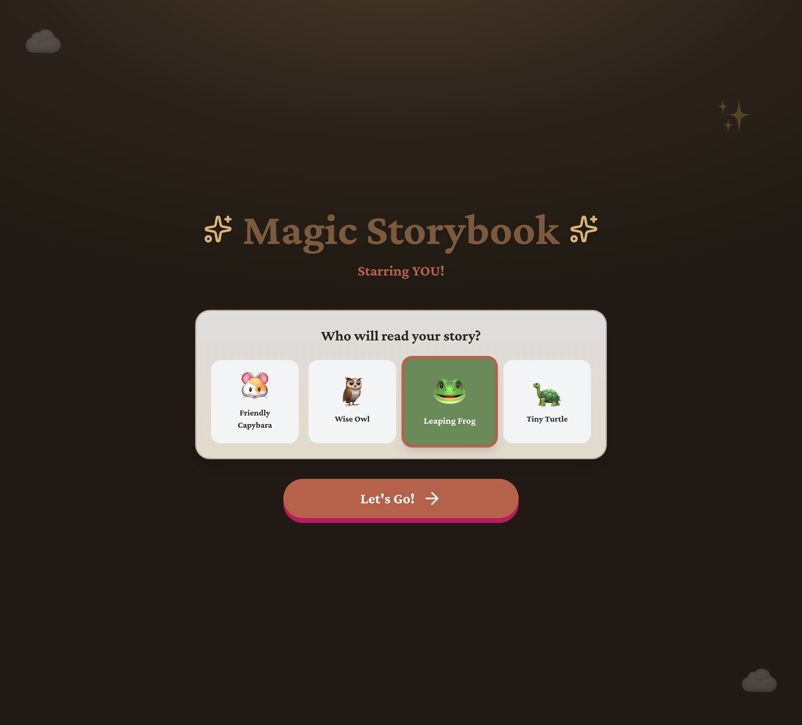
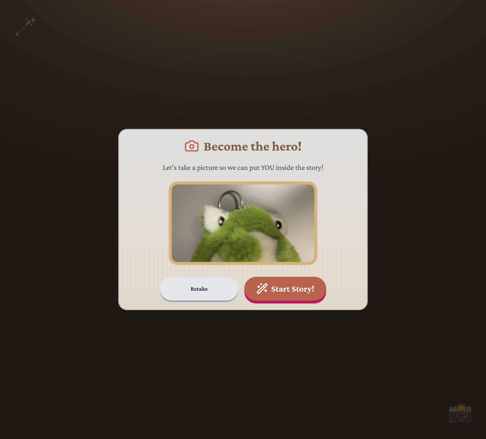
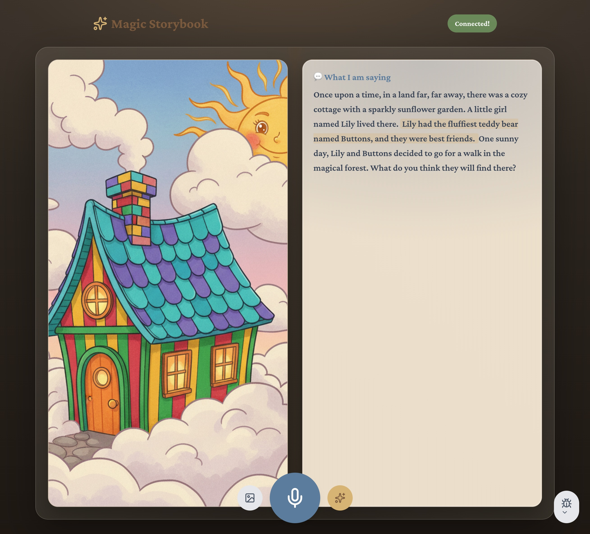
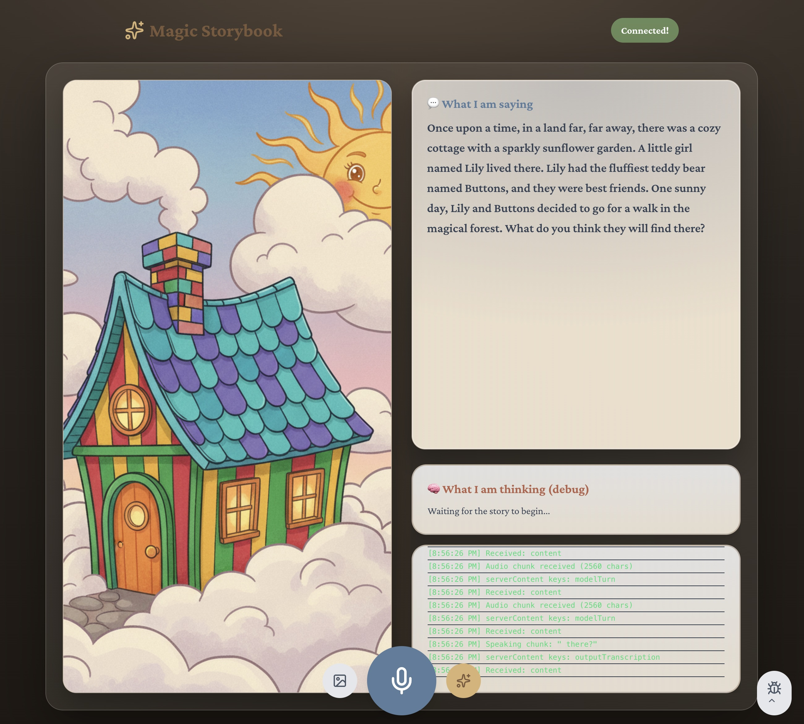
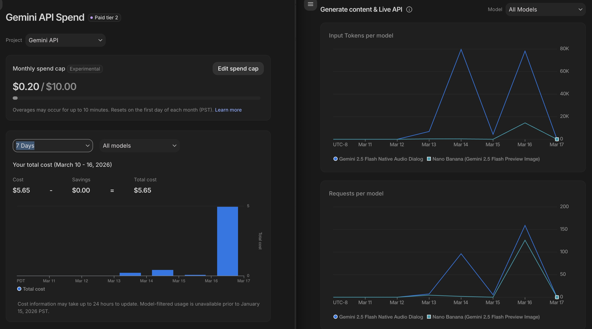

# 2026-choose-your-own-adventure-storybook

Reading to a child is a magical experience, but static books can't always keep up with a toddler's boundless imagination. We wanted to create an experience where a 3-year-old isn't just listening to a story, but living it. By combining real-time voice interaction with instant AI illustration, we aimed to bridge the gap between imagination and reality, creating a digital "living" storybook that responds to a child's voice and choices instantly.

## What it does
**Let's Go On An Adventure!** is an interactive, voice-driven storybook. 
*   **Live Narration**: During onboarding, you can choose from 4 different narrator characters that speaks directly to the child.
*   **Voice Interactivity**: You can talk back to the story. If you say you want to go "into the dragon's cave," the narrator hears you and pivots the plot in real-time. (Powered by the **Gemini 2.5 Flash Multimodal Live API** for low-latency, natural voice conversations.)
*   **Dynamic Illustrations**: As the story unfolds, the app uses Vertex AI (**Nano Banana**, aka `gemini-2.5-flash-image`) to generate beautiful, child-friendly illustrations of the specific scenes being narrated.
*   **Personalization**: The system can take a reference photo and ensure the "hero" of the generated illustrations consistently looks like the child, making them the true star of the adventure.

## Screenshots

| 1. Choose your Narrator | 2. Become the Hero! |
| :---: | :---: |
|  |  |

| 3. Live Storytelling | 4. Debugging Tools |
| :---: | :---: |
|  |  |

| 5. Cost Monitoring (Gemini API) |
| :---: |
|  |

## Accomplishments
*   **Zero-Latency Feel**: Creating a custom server architecture that lets the narrator start speaking almost instantly when the app loads.
*   **Visual Consistency**: Successfully using reference images with Nano Banana to keep the protagonist’s appearance consistent across different generated scenes.
*   **Robust Infrastructure**: Building a production-grade GCP deployment that can be stood up or torn down with a few Terraform commands.

## Learnings
*   **Multimodal Design**: We learned how to design prompts for the Live API that balance "narrator personality" with "technical tags" (like `<image>`) to trigger secondary actions without breaking the fourth wall, and using asynchoronous server architecture to handle the latency of the Live API and Image Generation.
*   **Narration word tracking**: To highlight the sentence where the narrator is at, we implemented an estimator that estimate where the TTS narration is at based on the audio chunk length and the text length.

## Further Developments
*   **Multi-Character Interaction**: Adding more voices and personalities for different characters in the story.
*   **Story Archiving**: Allowing parents to save the unique journey their child took as a printable, digital storybook.

## Tools Used
- IDE:
    - Antigravity (with Gemini 3.1 Pro, Claude Opus 4.6, Gemini 3 Flash)
    - Codex (with GPT-4, GPT-2-codex)
- Agent Skills:
    - UI: pbakaus/impeccable
- Terraform for infrastructure as code
- Docker for containerization
- Next.js for app framework

## Google services used:
- GenAI SDK for multimodal live API for interruptible voice agent
- Vertex AI Nano Banana for personalized illustrations
- Google Cloud Storage and Firestore for data persistence and state management
- Google Cloud Run for hosting the app

## Note
For image generation, you need to link your Google Cloud project to a billing account.
The current model is set to `gemini-2.5-flash-image` (aka Nano Banana) to keep costs low.
Set the `GEMINI_IMAGE_GENERATION_MODEL` variable in your `.env` file to either `imagen-4.0-fast-generate-001` or `gemini-3-pro-image-preview` for better quality (but higher cost).

## Testing Locally
To run and test the storybook locally before deploying:
1. Get a Gemini API key from Google AI Studio or Vertex AI  
    - https://aistudio.google.com/api-keys
    - https://console.cloud.google.com/vertex-ai/studio/settings/api-keys
2. Copy .env.example to .env.local and add your API keys:
    - `GEMINI_API_KEY` (Required for AI generation)
    - `GCS_BUCKET_NAME` (Optional: used for Image Storage. If omitted, uses local data URIs)
    - `GOOGLE_APPLICATION_CREDENTIALS` (Optional: path to service account key. If omitted, uses a local JSON file to mock Firestore and GCS)
3. Start the dev server: npm run dev
4. Navigate to http://localhost:3000
5. Pick a character (e.g., Friendly Capybara), take a webcam picture!
6. Allow the microphone on the Storybook page. Start talking back to the Capybara to change the flow of the story.

## Deploy
1. Copy `terraform/terraform.tfvars.example` to `terraform/dev.tfvars` and update the values:
    - `TF_VAR_project_id="your-google-cloud-project-id"`
    - `TF_VAR_region="us-central1"`
2. Setup infrastructure:
```bash
cd terraform
terraform init
terraform apply -var-file=dev.tfvars

# Replace [REGION] and [PROJECT_ID] with your own values.
# Example below the command.
# 0. Set your project
gcloud config set project [PROJECT_ID]
# e.g. gcloud config set project gen-lang-client-0572697337

# 1. Auth Docker
gcloud auth configure-docker [REGION]-docker.pkg.dev
# e.g. gcloud auth configure-docker us-central1-docker.pkg.dev

# 2. Build (alternatively, update variables in package.json to run `npm run deploy` to replace docker build and docker push commands)
cd ..
docker build --platform linux/amd64 -t [REGION]-docker.pkg.dev/[PROJECT_ID]/storybook-repo/app:latest .
# e.g. docker build --platform linux/amd64 -t us-central1-docker.pkg.dev/gen-lang-client-0572697337/storybook-repo/app:latest .

# 3. Push to Google Cloud Run
docker push [REGION]-docker.pkg.dev/[PROJECT_ID]/storybook-repo/app:latest
# e.g. docker push us-central1-docker.pkg.dev/gen-lang-client-0572697337/storybook-repo/app:latest

# 4. Update Google Cloud Run config
terraform apply -var-file=dev.tfvars
```

## Tear down
1. Run `terraform destroy -var-file=dev.tfvars` to delete the Cloud Run service, Cloud Storage bucket, and Firestore database, to stop incurring costs.

## Important Cost Precautions
When running generative AI models and cloud infrastructure, it is important to protect yourself against accidental charges.

1. **Set up a Billing Alert:** Go to the [Google Cloud Billing Console](https://console.cloud.google.com/billing) and create a Budget Alert (e.g., alert me at $1.00, $5.00, and $10.00). This won't hard-stop your app, but it will email you immediately if costs spike.
2. **Hard-cap Cloud Run:** To prevent a billing spike from a sudden surge in traffic (or an infinite loop), the `terraform/main.tf` file has been configured with `max_instance_count = 2`. This guarantees Cloud Run will never scale past 2 instances. Increase this value if you expect more traffic.
